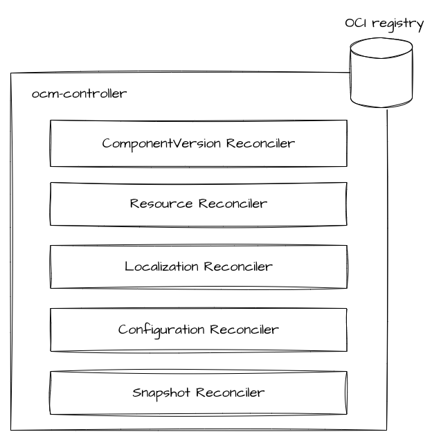
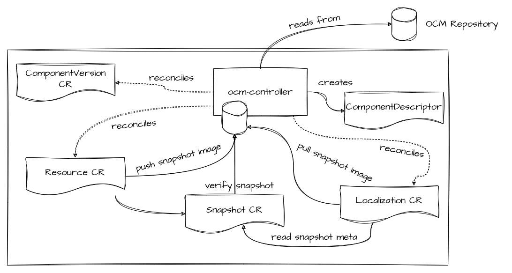

# ocm-controller

[](https://api.reuse.software/info/github.com/open-component-model/ocm-controller)

Main repository for ocm-controller.

## Architecture

The `ocm-controller` manages multiple Custom Resources and therefore contains several reconcilers. It also provides an OCI registry used to cache blobs and make them accessible to clients within the cluster. 



The `ocm-controller` is responsible for the core work necessary to utilise resources from an `OCM` component in a Kubernetes cluster. This includes resolving `ComponentDescriptor` metadata for a particular component version, performing authentication to OCM repositories, retrieving artifacts from OCM repositories, making individual resources from the OCM component available within the cluster, performing localization and configuration. 

Snapshots are used to pass blobs between controllers and snapshots are stored in the internal registry managed by the `ocm-controller`.



## Testing

In order to test, run the manager locally with a kind cluster present on the system.

- apply all CRDs from the crd/base folder
- run the controller:

```console
make
./bin/manager -zap-log-level 4
```

- apply all the sample objects

To trigger the `reconcile` loop ( because manually updating the status doesn't trigger it ) run something like this:

```console
kubectl annotate --overwrite ... "trigger/reconcile=$(date -u+%)"
```

## Licensing

Copyright 2022 SAP SE or an SAP affiliate company and Open Component Model contributors.
Please see our [LICENSE](LICENSE) for copyright and license information.
Detailed information including third-party components and their licensing/copyright information is available [via the REUSE tool](https://api.reuse.software/info/github.com/open-component-model/ocm-controller).
