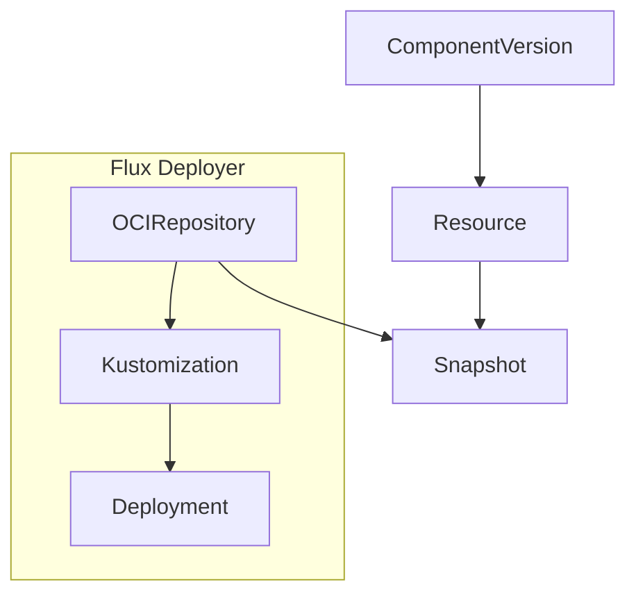

# ocm-controller

[](https://api.reuse.software/info/github.com/open-component-model/ocm-controller)  [](https://github.com/open-component-model/ocm-controller/actions/workflows/e2e.yaml)

This is the main repository for `ocm-controller`. The `ocm-controller` is designed to enable the automated deployment of software using the [Open Component Model](https://ocm.software) and Flux.

It has the following features:
- Resolves [`ComponentDescriptor`](https://github.com/open-component-model/ocm-spec/blob/ed97a6a924f514c78acfe29ee7973ed91b0ddba0/doc/glossary.md#component-descriptor) metadata for a particular [component version](https://github.com/open-component-model/ocm-spec/blob/ed97a6a924f514c78acfe29ee7973ed91b0ddba0/doc/glossary.md#component-version)
- Performs authentication with [OCM repositories](https://github.com/open-component-model/ocm-spec/blob/ed97a6a924f514c78acfe29ee7973ed91b0ddba0/doc/glossary.md#component-descriptor#component-repository)
- Retrieves [artifacts](https://github.com/open-component-model/ocm-spec/blob/ed97a6a924f514c78acfe29ee7973ed91b0ddba0/doc/glossary.md#artifact) from OCM repositories
- Verifies components
- Makes individual resources from components available within the cluster
- Performs localization and configuration of component resources

## Quick Start

### Pre-requisites

- Create a kind cluster: `kind create cluster`
- Make sure flux is installed in your cluster using: `flux install`
- Install the controller using: `ocm controller install`

---

In this tutorial, we'll deploy the `ocm.software/podinfo` component which contains a Kubernetes `Deployment` manifest for the `podinfo` application.

To get started, save the following `ComponentVersion` to a file named `component_version.yaml`:

```yaml
# component_version.yaml
apiVersion: delivery.ocm.software/v1alpha1
kind: ComponentVersion
metadata:
  name: podinfo
  namespace: ocm-system
spec:
  interval: 10m0s
  component: ocm.software/podinfo
  version:
    semver: ">=v6.2.3"
  repository:
    url: ghcr.io/open-component-model
```

Apply the `ComponentVersion`:

```bash
kubectl apply -f component_version.yaml
```

Create a `Resource` for the `deployment` resource:

```yaml
# resource.yaml
apiVersion: delivery.ocm.software/v1alpha1
kind: Resource
metadata:
  name: podinfo-deployment
  namespace: ocm-system
spec:
  interval: 10m0s
  sourceRef:
    apiVersion: delivery.ocm.software/v1alpha1
    kind: ComponentVersion
    name: podinfo
    namespace: ocm-system
    resourceRef:
      name: deployment
```

Apply the `Resource`:

```bash
kubectl apply -f resource.yaml
```

Create a `FluxDeployer` to apply the `Resource` and save it to a file named `deployer.yaml`:

```yaml
# deployer.yaml
apiVersion: delivery.ocm.software/v1alpha1
kind: FluxDeployer
metadata:
  name: podinfo
  namespace: ocm-system
spec:
  interval: 10m0s
  sourceRef:
    apiVersion: delivery.ocm.software/v1alpha1
    kind: Resource
    name: podinfo-deployment
  kustomizationTemplate:
    path: ./
    prune: true
    targetNamespace: default
```

Apply the `FluxDeployer`:

```
kubectl apply -f deployer.yaml
```

View the deployment spinning up:

`kubectl get po -n default`

### What just happened?

We used `ComponentVersion` to retrieve the `ocm.software/podinfo` component from a remote OCM repository (`ghcr.io/open-component-model`).
We then fetched a resource from this component using the `Resource` CRD.

The `ocm-controller` fetched this resource and created a [Snapshot](#snapshot) containing the contents of the OCM resource. This [snapshot](#snapshot) is a Flux compatible OCI image which is stored in a registry managed by `ocm-controller`.

Because the [snapshot](#snapshot) is Flux compatible we asked the `ocm-controller` to create a corresponding Flux source for it. This means that we can then use a Flux `Kustomization` resource to apply content of it to the cluster.

The following diagram illustrates the flow:



## Elements

### ComponentVersion

Retrieves a `ComponentVersion` from an OCM repository. Handles authentication with the repository and optionally verifies the component using provided signatures.

### Resource

Makes a resource available within the cluster as a [snapshot](#snapshot).

#### HelmChart type Resource

Consider a component helm resource defined as such:

```yaml
components:
- name: github.com/open-component-model/helm-test
  version: "v1.0.0"
  provider:
    name: ocm.software
  resources:
  - name: charts
    type: helmChart
    version: 6.3.5
    input:
      type: helm
      version: 6.3.5
      path: charts/podinfo-6.3.5.tgz
```

The following `Resource` CRD will fetch this reasource:

```yaml
apiVersion: delivery.ocm.software/v1alpha1
kind: Resource
metadata:
  name: ocm-with-helm-deployment
  namespace: ocm-system
spec:
  interval: 10m
  sourceRef:
    kind: ComponentVersion
    name: ocm-with-helm
    namespace: ocm-system
    resourceRef:
      name: charts
      version: 6.3.5
```

_Note_: `resourceRef.Version` here must match the resource's meta version in order to create the right
layer information and tag in our internal OCI repository. If there is a mismatch here, the helm deployer
resource will not find the chart.

A corresponding Helm FluxDeployer might look something like this:

```yaml
apiVersion: delivery.ocm.software/v1alpha1
kind: FluxDeployer
metadata:
  name: fluxdeployer-podinfo-pipeline-backend
  namespace: ocm-system
spec:
  interval: 1m0s
  sourceRef:
    kind: Resource
    name: ocm-with-helm-deployment
  helmReleaseTemplate:
    interval: 5m
```

This will use and OCIRepository source for the helm chart in our registry using latest (2.3.0) Flux capability described
in [this](https://fluxcd.io/blog/2024/05/flux-v2.3.0/#enhanced-helm-oci-support) blog post.

To configure a helm chart value's file the following configuration can be used:

```yaml
apiVersion: delivery.ocm.software/v1alpha1
kind: Configuration
metadata:
  name: ocm-with-helm-configured
  namespace: ocm-system
spec:
  interval: 1m
  sourceRef:
    kind: Resource
    name: ocm-with-helm-deployment
  configRef:
    kind: ComponentVersion
    name: ocm-with-helm
    resourceRef:
      name: config
      version: 1.0.3
      extraIdentity:
        chartVersion: 6.3.5
  values:
    replicas: 2
```

Notice the `extraIdentity` field. When we create a configuration OCI repository, Flux makes sure that the TAG matches
the chart version. We use this extra information to set the correct version of the layer so Flux finds the chart to
deploy. It's possible to omit it if the version of the resource matches the chart version.

Once the resource is configured, the following FluxDeployer can be used to deploy it:

```yaml
apiVersion: delivery.ocm.software/v1alpha1
kind: FluxDeployer
metadata:
  name: fluxdeployer-podinfo-configured
  namespace: ocm-system
spec:
  interval: 1m0s
  sourceRef:
    kind: Configuration
    name: ocm-with-helm-configured
  helmReleaseTemplate:
    interval: 5m
```

### Localization

This Localization represents a way to configure resources to use local references once a transfer occurs.
To understand more, please take a look at [OCM Localization](https://github.com/open-component-model/ocm-spec/blob/67c51bfbcdd83b734f8b1f93eccab79a553eb6ea/doc/05-guidelines/02-contract.md#example-helm-deployment) reference.

Let's take a look at a simple `Localization` object:

```yaml
apiVersion: delivery.ocm.software/v1alpha1
kind: Localization
metadata:
  name: podinfo-localization
  namespace: mpas-ocm-applications
spec:
  configRef:
    kind: ComponentVersion
    name: podinfocomponent-version
    namespace: mpas-ocm-applications
    resourceRef:
      name: config
      version: 1.0.0
  interval: 10m0s
  sourceRef:
    kind: ComponentVersion
    name: podinfocomponent-version
    namespace: mpas-ocm-applications
    resourceRef:
      name: manifests
      version: 1.0.0
```

The two most essential pieces are the `sourceRef` and the `configRef`. The `sourceRef` contains the resource to localize
while the `configRef` points to the resource containing the localization values. In this case, an image reference:

```yaml
localization:
- resource:
    name: image
  file: deploy.yaml
  image: spec.template.spec.containers[0].image
```

These are OCM's localization rules.

### Configuration

Use configuration rules to apply custom settings to objects. These could be manifest files, like a `Deployment` for which
we configure the replica count. Or a setting for a Redis database, etc.

It's much the same as [Localization](#localization) in design:

```yaml
apiVersion: delivery.ocm.software/v1alpha1
kind: Configuration
metadata:
  name: podinfo-configuration
  namespace: mpas-ocm-applications
spec:
  configRef:
    kind: ComponentVersion
    name: podinfocomponent-version
    namespace: mpas-ocm-applications
    resourceRef:
      name: config
      version: 1.0.0
  interval: 10m0s
  sourceRef:
    apiVersion: delivery.ocm.software/v1alpha1
    kind: Localization
    name: podinfo-localization
    namespace: mpas-ocm-applications
  valuesFrom:
    configMapSource:
      key: values.yaml
      sourceRef:
        name: podinfo-values-500b59e1
      subPath: podinfo
```

However, it's much more complex. It uses [cue-lang](https://cuelang.org/) to achieve a flexibility in configuring and
defining user-friendly default values.

For example:

```cue
// | Parameter | Type | Default | Description                          |
// |-----------|------|---------|--------------------------------------|
// | replicas  | int  | 1       | The number of replicas for the cache |
#SchemaVersion: "v1.0.0"
redis: replicas: 1
```

This is a basic CUE config that will be used to set the Redis deployment's replica count.

### FluxDeployer

Creates a Flux `Kustomization` object and points it to a [snapshot](#snapshot). This resource represents a connection with Flux to be used to
deploy a resource that might contain a set of manifest files. Other deployers can later be implemented if requested.

### Snapshot

A Kubernetes resource that manages a Flux compatible single-layer OCI image. Enables interoperability between OCM and Flux.

A snapshot might look something like this:

```yaml
apiVersion: delivery.ocm.software/v1alpha1
kind: Snapshot
metadata:
  name: podinfo-localization-6t34w4w
  namespace: mpas-ocm-applications
spec:
  digest: sha256:1ecc4af8574082e411b9c90903c73befbf5c8aefb98eae835ddbcd3d60ee1795
  identity:
    component-name: ocm.software-demos-podinfo-v1.0.0-15225012871519309609
    component-version: v1.0.0
    resource-name: config
    resource-version: 1.0.0
  tag: "7833"
status:
  conditions:
    - lastTransitionTime: "2024-04-04T11:20:38Z"
      message: Snapshot with name 'podinfo-localization-6t34w4w' is ready
      observedGeneration: 2
      reason: Succeeded
      status: "True"
      type: Ready
  digest: sha256:1ecc4af8574082e411b9c90903c73befbf5c8aefb98eae835ddbcd3d60ee1795
  observedGeneration: 2
  repositoryURL: https://registry.ocm-system.svc.cluster.local:5000/sha-3967392847701103634
  tag: "7833"
```

These are _never_ created by hand. They are always an end-result of some in-cluster process.

The important bits are the digest, repository URL and the tag. These three signify and identify of what has been created.
The URL will always point to the in-cluster managed registry.

## Registry

This project also creates an in-cluster HTTPS based OCI registry. This registry is used as a sync-point between the
ocm-controller and the Flux eco-system. It also serves as a cache. All three sync objects, [Resource](#resource), [Localization](#localization) and
[Configuration](#configuration) will put the end result into this cache.

This means that fetching a remote resource happens only _once_ at the begin of a sync chain. Then that resource will exist
in the local registry and any further operations will take it from there.

## Testing

To run the test suite use `make test`.

`Tinygo` is used to compile the test suite to a single binary. This binary is then used to run the tests.

In order to install `tinygo` visit the [installation instructions](https://tinygo.org/getting-started/install/).

## Local Testing

`ocm-controller` has a `Tiltfile` that can be used for rapid development. [tilt](https://tilt.dev/) is a convenient
little tool to spin up a controller and do some extra setup in the process conditionally. It will also keep updating
the environment via a process that is called [control loop](https://docs.tilt.dev/controlloop.html); it's similar to
a controller's reconcile loop.

To use tilt, we'll have to first prime a test cluster. `ocm-controller` requires certificates to be present for the in-cluster
registry that's running using https. To prime a test cluster simply execute `make prime-test-cluster`. This will spin up
a local KinD cluster, download the generated certificates and add them to the local trust-store using **mkcert**.

This project also requires Flux to be installed in the cluster. For testing purposes, there is no need to configure a Flux `Source`.
Simply, run `flux install` to install the controllers and the CRDs.

Once that is done, we are ready to start up the controller. Run `tilt up`, then hit `<space>` to enter tilt's
ui. You should see ocm-controller starting up.

## Installing

There are two ways to install ocm-controller. One, is by using `ocm controller install` command from the [OCM](https://github.com/open-component-model/ocm) project.

This CLI will install prerequisites as well and check the cluster state during installation to make sure that all elements
are correctly installed and up and running.

The other way is using the provided helm chart for the project under `./deploy` folder.

To do this, use the following command:

```
helm install ocm-controller oci://ghcr.io/open-component-model/helm/ocm-controller --version v0.25.3
```

This does require that certain items, like certificate secrets are pre-created by the user.
For details, checkout the prime-test-cluster scripts under the `hack` folder.

## Uninstall

Again, there are two ways to uninstall the controller. Using the ocm cli run `ocm controller uninstall`.

With helm, run:

```
helm uninstall ocm-controller
```

## Licensing

Copyright 2022 SAP SE or an SAP affiliate company and Open Component Model contributors.
Please see our [LICENSE](LICENSE) for copyright and license information.
Detailed information including third-party components and their licensing/copyright information is available [via the REUSE tool](https://api.reuse.software/info/github.com/open-component-model/ocm-controller).
