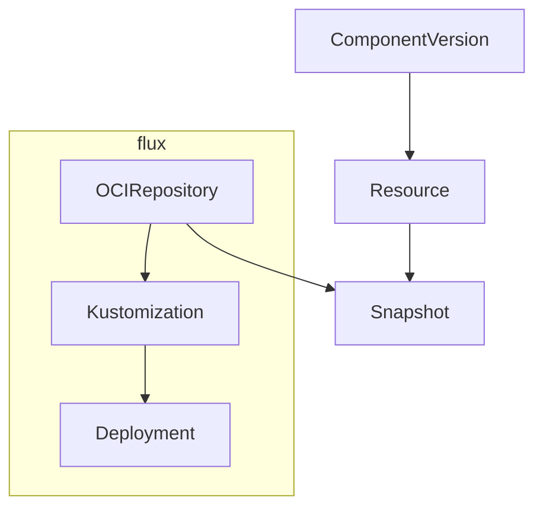

# ocm-controller

[](https://api.reuse.software/info/github.com/open-component-model/ocm-controller)

This is the main repository for `ocm-controller`. The `ocm-controller` is designed to enable the automated deployment of software using the Open Component Model and Flux.

It has the following features:
- Resolves [`ComponentDescriptor`](https://github.com/open-component-model/ocm-spec/blob/main/doc/glossary.md#component-descriptor) metadata for a particular [component version](https://github.com/open-component-model/ocm-spec/blob/main/doc/glossary.md#component-version)
- Performs authentication with [OCM repositories](https://github.com/open-component-model/ocm-spec/blob/main/doc/glossary.md#component-repository)
- Retrieves [artifacts](https://github.com/open-component-model/ocm-spec/blob/main/doc/glossary.md#artifact) from OCM repositories
- Verifies components
- Makes individual resources from components available within the cluster
- Performs localization and configuration of component resources

## Quick Start

### Pre-requisites
- Create a kind cluster: `kind create cluster`
- Make sure flux is installed in your cluster using: `flux install`
- Install the controller using: `make install & make deploy`

---

In this tutorial we'll deploy the `phoban.io/podinfo` component which contains a Kubernetes `Deployment` manifest for the `podinfo` application.

To get started save the following `ComponentVersion` to a file named `component_version.yaml`:

```yaml
# component_version.yaml
apiVersion: delivery.ocm.software/v1alpha1
kind: ComponentVersion
metadata:
  name: podinfo
  namespace: ocm-system
spec:
  interval: 10m0s
  component: phoban.io/podinfo
  version:
    semver: ">=v6.2.3"
  repository:
    url: ghcr.io/phoban01
```

Apply the `ComponentVersion`:

```bash
kubectl apply -f component_version.yaml
```

Create a `Resource` for the `deployment` resource:

```yaml
# resource.yaml
apiVersion: delivery.ocm.software/v1alpha1
kind: Resource
metadata:
  name: deployment
  namespace: ocm-system
spec:
  interval: 10m0s
  componentVersionRef:
    name: podinfo
    namespace: ocm-system
  resource:
    name: deployment
  snapshotTemplate:
    name: podinfo
    createFluxSource: true
```

Apply the `Resource`:

```bash
kubectl apply -f resource.yaml
```

Create a Flux `Kustomization` to apply the `Resource` and save it to a file named `resource_kustomization.yaml`:

```yaml
# resource_kustomization.yaml
apiVersion: kustomize.toolkit.fluxcd.io/v1beta2
kind: Kustomization
metadata:
  name: podinfo
  namespace: ocm-system
spec:
  interval: 10m0s
  path: ./
  prune: true
  targetNamespace: default
  sourceRef:
    kind: OCIRepository
    name: podinfo
    namespace: ocm-system
```

Apply the `Kustomization`:

```
kubectl apply -f resource_kustomization.yaml
```

View the deployment spinning up:

`kubectl get po -n default`

### What just happened?

We used `ComponentVersion` to retrieve the `phoban.io/podinfo` component from an remote OCM repository (`ghcr.io/phoban01`). We then fetched a resource from this component using the `Resource` CRD.

The `ocm-controller` fetched this resource and created a `Snapshot` containing the contents of the OCM resource. This `Snapshot` is a Flux compatible OCI image which is stored in a registry managed by the `ocm-controller`.

Because the `Snapshot` is Flux compatible we asked the `ocm-controller` to create a corresponding Flux source for the `Snapshot`. This means that we can then use a Flux `Kustomization` resource to apply the `Snapshot` to the cluster.

The following diagram illustrates the flow:



## Elements

### ComponentVersion

Retrieves a `ComponentVersion` from an OCM repository. Handles authentication with the repository and optionally verifies the component using provided signatures.

### Resource

Makes a resource available within the cluster as a snapshot.

### Localization
<!-- TODO: add a dedicated doc on Localization -->
Localizes a resource using the specified configuration resource.

### Configuration
<!-- TODO: add a dedicated doc on Localization -->
Configures a resource using the specified configuration resource.

### Snapshot

A Kubernetes resource that manages a Flux compatible single layer OCI image. Enables interoperability between OCM and Flux.

## Testing

To run the test suite use `make test`.

## Licensing

Copyright 2022 SAP SE or an SAP affiliate company and Open Component Model contributors.
Please see our [LICENSE](LICENSE) for copyright and license information.
Detailed information including third-party components and their licensing/copyright information is available [via the REUSE tool](https://api.reuse.software/info/github.com/open-component-model/ocm-controller).
