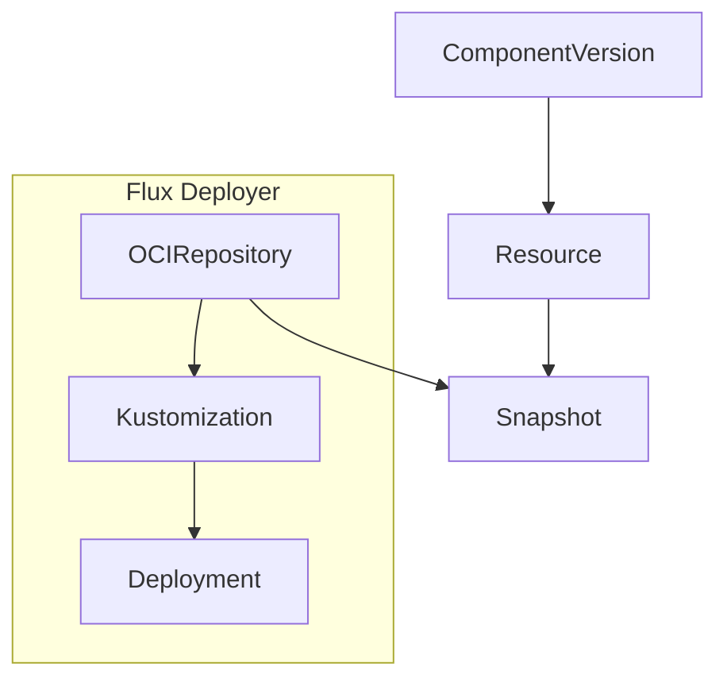

# ocm-controller

[](https://api.reuse.software/info/github.com/open-component-model/ocm-controller)  [](https://github.com/open-component-model/ocm-controller/actions/workflows/e2e.yaml)

This is the main repository for `ocm-controller`. The `ocm-controller` is designed to enable the automated deployment of software using the [Open Component Model](https://ocm.software) and Flux.

It has the following features:
- Resolves [`ComponentDescriptor`](https://github.com/open-component-model/ocm-spec/blob/ed97a6a924f514c78acfe29ee7973ed91b0ddba0/doc/glossary.md#component-descriptor) metadata for a particular [component version](https://github.com/open-component-model/ocm-spec/blob/ed97a6a924f514c78acfe29ee7973ed91b0ddba0/doc/glossary.md#component-version)
- Performs authentication with [OCM repositories](https://github.com/open-component-model/ocm-spec/blob/ed97a6a924f514c78acfe29ee7973ed91b0ddba0/doc/glossary.md#component-descriptor#component-repository)
- Retrieves [artifacts](https://github.com/open-component-model/ocm-spec/blob/ed97a6a924f514c78acfe29ee7973ed91b0ddba0/doc/glossary.md#artifact) from OCM repositories
- Verifies components
- Makes individual resources from components available within the cluster
- Performs localization and configuration of component resources

## Quick Start

### Pre-requisites
- Create a kind cluster: `kind create cluster`
- Make sure flux is installed in your cluster using: `flux install`
- Install the controller using: `ocm controller install`

---

In this tutorial we'll deploy the `phoban.io/podinfo` component which contains a Kubernetes `Deployment` manifest for the `podinfo` application.

To get started save the following `ComponentVersion` to a file named `component_version.yaml`:

```yaml
# component_version.yaml
apiVersion: delivery.ocm.software/v1alpha1
kind: ComponentVersion
metadata:
  name: podinfo
  namespace: ocm-system
spec:
  interval: 10m0s
  component: phoban.io/podinfo
  version:
    semver: ">=v6.2.3"
  repository:
    url: ghcr.io/phoban01
```

Apply the `ComponentVersion`:

```bash
kubectl apply -f component_version.yaml
```

Create a `Resource` for the `deployment` resource:

```yaml
# resource.yaml
apiVersion: delivery.ocm.software/v1alpha1
kind: Resource
metadata:
  name: podinfo-deployment
  namespace: ocm-system
spec:
  interval: 10m0s
  sourceRef:
    apiVersion: delivery.ocm.software/v1alpha1
    kind: ComponentVersion
    name: podinfo
    namespace: ocm-system
    resourceRef:
      name: deployment
```

Apply the `Resource`:

```bash
kubectl apply -f resource.yaml
```

Create a `FluxDeployer` to apply the `Resource` and save it to a file named `deployer.yaml`:

```yaml
# deployer.yaml
apiVersion: delivery.ocm.software/v1alpha1
kind: FluxDeployer
metadata:
  name: podinfo
  namespace: ocm-system
spec:
  sourceRef:
    apiVersion: delivery.ocm.software/v1alpha1
    kind: Resource
    name: podinfo-deployment
  kustomizationTemplate:
    interval: 10m0s
    path: ./
    prune: true
    targetNamespace: default
```

Apply the `FluxDeployer`:

```
kubectl apply -f deployer.yaml
```

View the deployment spinning up:

`kubectl get po -n default`

### What just happened?

We used `ComponentVersion` to retrieve the `phoban.io/podinfo` component from an remote OCM repository (`ghcr.io/phoban01`). We then fetched a resource from this component using the `Resource` CRD.

The `ocm-controller` fetched this resource and created a `Snapshot` containing the contents of the OCM resource. This `Snapshot` is a Flux compatible OCI image which is stored in a registry managed by the `ocm-controller`.

Because the `Snapshot` is Flux compatible we asked the `ocm-controller` to create a corresponding Flux source for the `Snapshot`. This means that we can then use a Flux `Kustomization` resource to apply the `Snapshot` to the cluster.

The following diagram illustrates the flow:



## Elements

### ComponentVersion

Retrieves a `ComponentVersion` from an OCM repository. Handles authentication with the repository and optionally verifies the component using provided signatures.

### Resource

Makes a resource available within the cluster as a snapshot.

#### HelmChart type Resource

In order to identify a Resource as a HelmChart an extra identify needs to be added. The key is `helmChart` and the
value is the name of the chart. For example:

```yaml
apiVersion: delivery.ocm.software/v1alpha1
kind: Resource
metadata:
  name: ocm-with-helm-deployment
  namespace: ocm-system
spec:
  interval: 10m
  sourceRef:
    kind: ComponentVersion
    name: ocm-with-helm
    namespace: ocm-system
    resourceRef:
      name: charts
      version: 6.3.5
      extraIdentity:
        helmChart: podinfo # name of the chart
```

This extra information is needed, because it cannot be inferred from the resource's information from OCM.

### Localization

Localizes a resource using the specified configuration resource.

### Configuration

Configures a resource using the specified configuration resource.

### Flux Deployer

Applies a resource to the cluster using Flux Kustomization controller.

### Snapshot

A Kubernetes resource that manages a Flux compatible single layer OCI image. Enables interoperability between OCM and Flux.

## Testing

To run the test suite use `make test`.

## Local Testing

`ocm-controller` has a `Tiltfile` which can be used for rapid development. [tilt](https://tilt.dev/) is a convenient
little tool to spin up a controller and do some extra setup in the process conditionally. It will also keep updating
the environment via a process that is called [control loop](https://docs.tilt.dev/controlloop.html); it's similar to
a controller's reconcile loop.

To use tilt, simply install it into your respective environment and run `tilt up` then hit `<space>` to enter tilt's
ui. You should see ocm-controller starting up.

For additional configuration take a look at the `tilt-settings.yaml.example` file. Use this file to fine-tune what
tilt can configure. For example, to set up `flux` to bootstrap your cluster automatically, add the following settings:

```yaml
flux:
  enabled: true
  bootstrap: true
  owner: <github-user>
  repository: <name of the flux repository>
  path: <path to flux configuration>
```

## Licensing

Copyright 2022 SAP SE or an SAP affiliate company and Open Component Model contributors.
Please see our [LICENSE](LICENSE) for copyright and license information.
Detailed information including third-party components and their licensing/copyright information is available [via the REUSE tool](https://api.reuse.software/info/github.com/open-component-model/ocm-controller).
