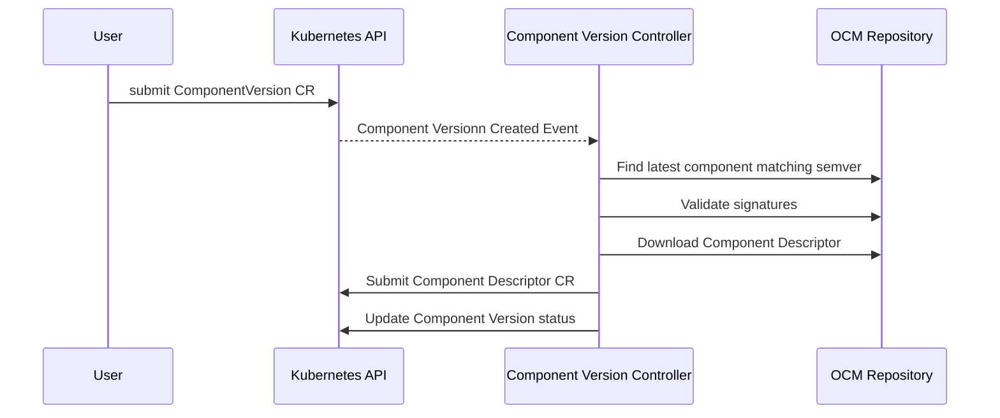
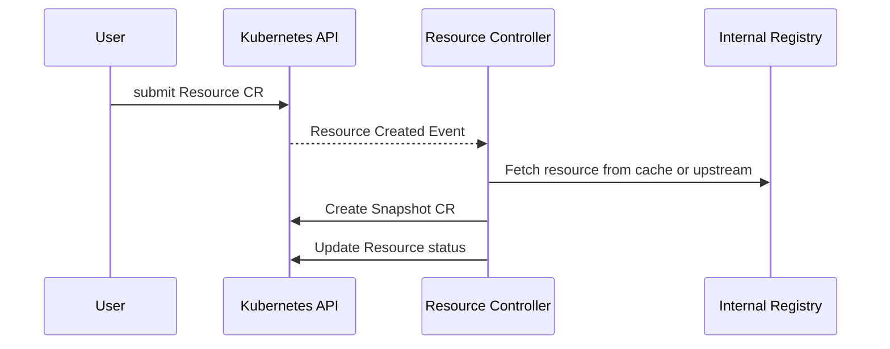
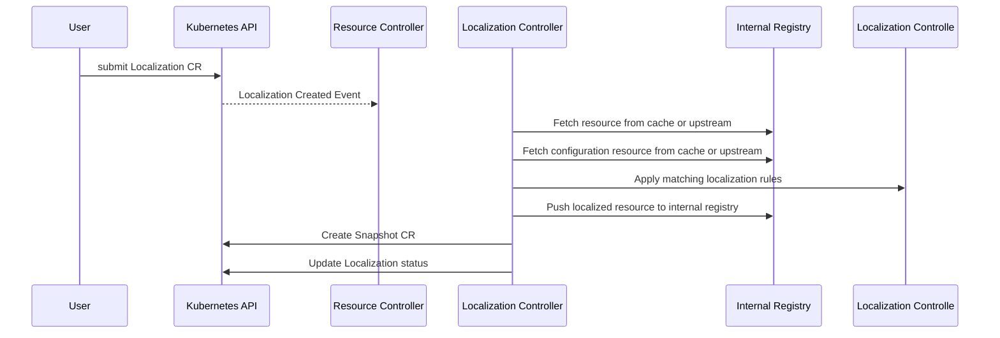

## Architecture

This document explains the architecture of the OCM Kubernetes Controller Set (KCS). The purpose of the KCS is to enable the automated deployment of components using Kubernetes and Flux.

The following functions are provided as part of the KCS:

- Replication: replication of components from one OCM repository to another
- Signature Verification: verification of component signatures before resources are reconciled
- Resource Reconciliation: individual resources can be extracted from a component and reconciled to machines internal or external to the cluster
- Resource transformation: resource localization & configuration can be performed out of the box, with any other kind of modification supported via an extensible architecture
- Component unpacking: multiple resources can be extracted from a component and transformed with a common set of user definable operations
- Git synchronization: resources extracted from a component can be pushed to a git repository

One of the central design decisions underpinning KCS is that resources should be composable. To this end we have introduced the concept of **Snapshots**; snapshots are immutable, Flux-compatible, single layer OCI images containing a single OCM resource. Snapshots are stored in an in-cluster registry and in addition to making component resources accessible for transformation, they also can be used as a caching mechanism to reduce unnecessary calls to the source OCM registry.

## Controllers

The KCS consists of the following controllers:
- OCM controller
- Replication controller
- Unpacker controller
- Remote controller
- Git sync controller

### OCM controller

The `ocm-controller` is responsible for the core work necessary to utilise resources from an `OCM` component in a Kubernetes cluster. This includes resolving `ComponentDescriptor` metadata for a particular component version, performing authentication to OCM repositories, retrieving artifacts from OCM repositories, making individual resources from the OCM component available within the cluster, performing localization and configuration.

Snapshots are used to pass resources between controllers and are stored in an in-cluster registry that is managed by the `ocm-controller`.

The `ocm-controller` is also responsible for managing the docker registry deployment which is used to store snapshots.

The `ocm-controller` consists of 4 sub-controllers:
- [Component Version Controller](#component-version-controller)
- [Resource Controller](#resource-controller)
- [Snapshot Controller](#snapshot-controller)
- [Localization Controller](#localization-controller)
- [Configuration Controller](#configuration-controller)

#### Component Version Controller

The Component Version controller reconciles component versions from an OCI repository by fetching the component descriptor and any referenced component descriptors. The component version controller will also verify signatures for all the public keys provided. The Component Version controller does not fetch any resources other than component descriptors. It is used by downstream controllers to access component descriptors and to attest the validity of component signatures. Downstream controllers can lookup a component descriptor via the status field of the component version resource. 



The custom resource for the component version controller looks as follows:

```yaml
apiVersion: delivery.ocm.software/v1alpha1
kind: ComponentVersion
metadata:
  name: component-x
  namespace: default
spec:
  interval: 10m0s
  component: github.com/open-component-model/component-x
  version:
    semver: >=v1.0.0
  repository:
    url: ghcr.io/jane-doe
    secretRef:
      name: ghcr-creds
  verify:
    - name: dev-signature
      publicKey:
        secretRef:
          name: signing-key
  references:
    expand: true
```

#### Resource Controller

The resource controller extracts resources from a component so that they may be used within the cluster. The resource is written to a snapshot which enables it to be cached and used by downstream processes. Resources can be selected using the `name` and `extraIdentity` fields. The resource controller requests resources using the in-cluster registry client. This means that if a resource has previously been requested then the cached version will be returned. If the resource is not found in the cache then it will be fetched from the OCM registry and written to the cache. Once the resource has been resolved and is stored in the internal registry a Snapshot CR is created 



The custom resource for the Resource controller is as follows:

```yaml
apiVersion: delivery.ocm.software/v1alpha1
kind: Resource
metadata:
  name: manifests
spec:
  interval: 10m0s
  componentVersionRef:
    name: component-x
    namespace: default
  resource:
    name: manifests
    referencePath:
      - name: nested-component
  snapshotTemplate:
    name: component-x-manifests
```

#### Snapshot Controller

The Snapshot controller reconciles Snapshot Custom Resources. Currently the functionality here is limited to updating the status thereby validating that the snapshotted resource exists. In the future we plan to expand the scope of this controller to include verification of snapshots.

#### Localization Controller

The localization controller applies localization rules to a snapshot. Because localization is deemed a common operation it is included along with the configuraton controller in the ocm-controller itself. Localizations can consume an OCM resource directly or a snapshot resource from the in-cluster registry. The configuration details for the localization operation are supplied via another OCM resource which should be a yaml file in the following format:

```yaml
apiVersion: config.ocm.software/v1alpha1
kind: ConfigData
metadata:
  name: ocm-config
  labels:
    env: test
localization:
- resource:
    name: image
  file: deploy.yaml
  image: spec.template.spec.containers[0].image
```

Localization parameters are specified under the `localization` stanza. The Localization controller will apply the localization rules that apply to the resource specified in the `source` field. 



The custom resource for the Localization controllers is as follows:

```yaml
apiVersion: delivery.ocm.software/v1alpha1
kind: Localization
metadata:
  name: manifests
spec:
  interval: 1m0s
  source:
    sourceRef:
      kind: Snapshot
      name: manifests
      namespace: default
  configRef:
    componentVersionRef:
      name: component-x
      namespace: default
    resource:
      resourceRef:
        name: config
  snapshotTemplate:
    name: manifests-localized
```

#### Configuration Controller

The configuration controller is used to configure resources for a particular environment and similar to localization the configured resource is written to a snapshot. Because configuration is deemed a common operation it is included along with the configuraton controller in the ocm-controller itself. The behaviour is as described for the localization controller but instead of retrieving confiugration from the `localization` stanza of the `ConfigData` file, the controller retrieves configuration information from the `configuration` stanza:

```yaml
apiVersion: config.ocm.software/v1alpha1
kind: ConfigData
metadata:
  name: ocm-config
  labels:
    env: test
configuration:
  defaults:
    color: red
    message: Hello, world!
  schema:
    type: object
    additionalProperties: false
    properties:
      color:
        type: string
      message:
        type: string
  rules:
  - value: (( message ))
    file: configmap.yaml
    path: data.PODINFO_UI_MESSAGE
  - value: (( color ))
    file: configmap.yaml
    path: data.PODINFO_UI_COLOR
```

### Unpacker Controller

The **Unpacker** controller is a meta-controller that is designed to enable execution of transformation pipelines for a set of component resources. The Unpacker controller allows for the selection of resources using OCM fields. Transformation is achieved via the PipelineTemplate resource which is a Golang template consisting of a number of "steps". Each step is a Kubernetes resource which will be created when the pipeline is rendered and applied. Variables are injected into the template which provide the component name and resource name.

### Replication controller

The Replication Controller handles the replication of components between OCI repositories. It consists of a single reconciler which manages subscriptions to a source OCI repository. A semver constraint is used to specify a target component version. Component versions satisfying the semver constraint will be copied to the destination OCI repository. The replication controller will verify signatures before performing replication.

### Remote Controller

The **remote controller** is used to deploy components to machines external to the Kubernetes cluster itself. It does this by connecting to the remote machine via ssh. SFTP is used to transfer resources from the component to the remote. Scripts can be specified as part of the `MachineManager` custom resource. These scripts enable the user to the various actions required to manage the installation of resources transferred to the remote machine via the remote controller.

## In-cluster Docker Registry

The `ocm-controller` manages a deployment of the docker registry. This provides a caching mechanism for resources and storage for snapshots whilst also enabling integration with Flux. Usage of the in-cluster registry is transparent to the clients and is handled via the ocm client library provided by the controller sdk.
